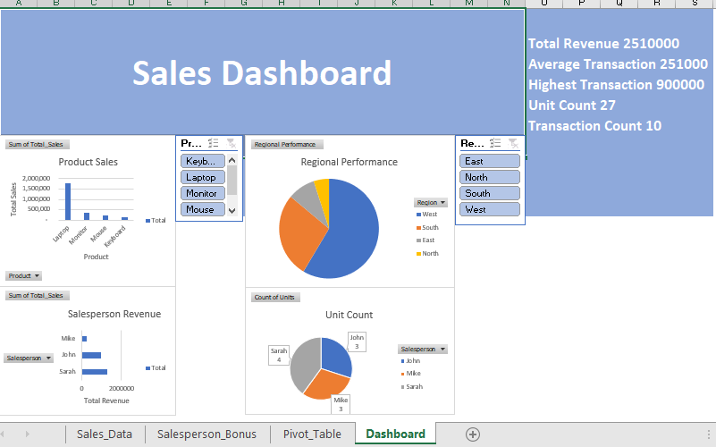

# Excel Sales Dashboard Project

## Project Overview

This project is a beginner-friendly interactive sales dashboard created in Microsoft Excel to analyze sales performance across products, regions, and sales representatives.

The goal of this project was to practice:

* Data cleaning
* Pivot Tables
* KPI creation
* Charts and visualizations
* Slicers and filtering
* Business analysis and storytelling

---

## Tools Used

* Microsoft Excel
* Pivot Tables
* Pivot Charts
* VLOOKUP
* IF Statements
* Conditional Formatting
* Slicers

---

## Key KPIs

* Total Revenue: 2,510,000
* Average Transaction Value: 251,000
* Highest Transaction: 900,000
* Total Units Sold: 27
* Transaction Count: 10

---

## Key Insights

* Laptops generated the highest revenue contribution.
* The West region recorded the strongest sales performance.
* Sarah generated the highest salesperson revenue across all regions.
* A few high-value transactions contributed heavily to overall revenue.

---

## Dashboard Preview

---

## What I Learned

This project helped me better understand how analysts:

* transform raw data into business insights,
* create dashboards for decision-making,
* and communicate findings visually.

As someone currently learning Data Analytics, this project also improved my confidence working with Excel dashboards and KPI reporting.
